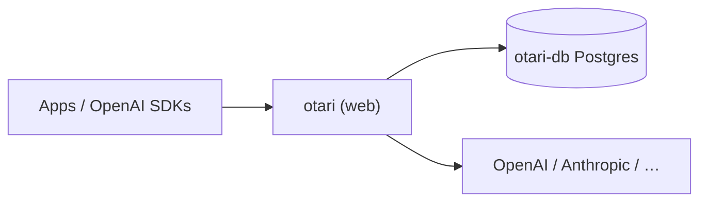

# Otari on Render

> Self-hosted OpenAI-compatible LLM gateway: one endpoint for 40+ providers, with virtual keys, budgets, and usage tracking on managed Postgres.

[](https://render.com/deploy?repo=https://github.com/ojusave/otari&branch=render-templates)

**Fork / branch:** [ojusave/otari](https://github.com/ojusave/otari) · `render-templates` (upstream: [mozilla-ai/otari](https://github.com/mozilla-ai/otari))

Deploy [Otari](https://github.com/mozilla-ai/otari) on Render without building from source. The Blueprint pulls `mzdotai/otari:0.2.0`, wires Render Postgres, generates a master key, and bootstraps a first-use API key on startup. Bring a provider key and point any OpenAI client at your `*.onrender.com` URL.


**At a glance:** ~$13/mo (Oregon, Starter web + Basic-256mb Postgres) · first deploy ~3–6 min · health check `/health`

---

## Highlights

- Official `mzdotai/otari` image: no uv/Python rebuild on Render
- Managed Postgres for keys, budgets, and usage (`OTARI_DATABASE_URL` wired automatically)
- Master key generated on deploy; bootstrap `gw-…` API key printed once in logs
- `OTARI_REQUIRE_PRICING=false` so an env-only first run works before you configure pricing

---

## Deploy

1. Click **[Deploy to Render](https://render.com/deploy?repo=https://github.com/ojusave/otari&branch=render-templates)** (Blueprint branch: `render-templates`, path: `render.yaml` at repo root).
2. On Apply, set at least one provider key (`OPENAI_API_KEY`, or add Anthropic/Mistral/Gemini after deploy).
3. Wait for **Live** (~3–6 min).
4. Open **otari → Logs**, copy the bootstrap `gw-…` key, then verify:

```bash
export OTARI_URL=https://<your-otari-service>.onrender.com
curl "$OTARI_URL/health"
```

```bash
curl "$OTARI_URL/v1/chat/completions" \
  -H "Authorization: Bearer gw-..." \
  -H "Content-Type: application/json" \
  -d '{
    "model": "openai:gpt-4o-mini",
    "messages": [{"role": "user", "content": "Say hello in one short sentence."}]
  }'
```

Swagger UI: `$OTARI_URL/docs`. App docs: [docs/](./docs/).

---

## What's included



| Resource | Plan | Role |
|----------|------|------|
| `otari` | Starter | Official gateway image; public HTTPS |
| `otari-db` | Basic-256mb | Keys, users, budgets, usage |

Default region: **oregon** (change in [`render.yaml`](./render.yaml)).

Optional Compose profiles (code-exec, web search, guardrails) are **not** in this Blueprint.

**Use it for:** team LLM proxy · virtual keys · pre-spend budgets · multi-provider OpenAI-compatible routing

---

## Configuration

**At Apply:** set at least one provider key (`OPENAI_API_KEY` is prompted; others work too).

**Auto-generated (do not rotate casually):**

| Variable | Purpose |
|----------|---------|
| `OTARI_MASTER_KEY` | Management endpoints (`/v1/keys`, `/v1/users`, `/v1/budgets`, …) |

**Wired for you:** `OTARI_DATABASE_URL` from `otari-db`.

<details>
<summary>Blueprint defaults and optional overrides</summary>

| Variable | Value | Notes |
|----------|-------|-------|
| `PORT` / `OTARI_PORT` | `8000` | Keep both aligned; Otari does not bind Render's `PORT` alone |
| `OTARI_HOST` | `0.0.0.0` | Required for Render port detection |
| `OTARI_REQUIRE_PRICING` | `false` | Image default is fail-closed; flip to `true` after you add pricing |
| `OTARI_AUTO_MIGRATE` | `true` | Alembic on startup |
| `OTARI_BOOTSTRAP_API_KEY` | `true` | Mints first `gw-…` when the DB has no keys |

Optional after deploy: `ANTHROPIC_API_KEY`, `MISTRAL_API_KEY`, `GEMINI_API_KEY`, `OTARI_CONFIG_YAML` / `OTARI_CONFIG_B64`, `OTARI_DEFAULT_PRICING`, `OTARI_AI_TOKEN` (hybrid with [otari.ai](https://otari.ai)). Full reference: [docs/configuration.md](./docs/configuration.md).

</details>

**Three keys:** provider key (upstream) · `OTARI_MASTER_KEY` (management) · `gw-…` (clients). Do not mix them.

---

## Cost

| Resource | ~USD/mo |
|----------|--------:|
| `otari` (Starter) | 7 |
| `otari-db` (Basic-256mb) | 6 |
| **Total** | **~13** |

LLM usage is billed by the provider. Free web sleeps and Free Postgres expires after 30 days: prefer this paid pair for a gateway.

---

## Customize

- **Pin image version:** edit `image.url` in [`render.yaml`](./render.yaml), push, Manual Deploy (`runtime: image` does not auto-update on tag moves).
- **Custom domain:** Dashboard → `otari` → Settings → Custom Domains (TLS automatic).
- **Fail-closed pricing:** set `OTARI_REQUIRE_PRICING=true` and supply pricing via `OTARI_CONFIG_YAML` or `POST /v1/pricing`.
- **Hybrid mode:** set `OTARI_AI_TOKEN` from otari.ai (see [docs/modes.md](./docs/modes.md)).

**Ops:** Postgres backups in the Dashboard. Logs: **otari → Logs**, or `render logs -r <id> --tail`. Gateway is largely stateless; state lives in Postgres.

---

## Troubleshooting

| Problem | Fix |
|---------|-----|
| Blueprint file not found | Branch must be `render-templates`; Blueprint path `render.yaml` (not a GitHub URL path). `main` has no Blueprint. |
| Health check / no open ports | Keep `PORT` and `OTARI_PORT` both `8000`. |
| Missing bootstrap key | Check first-boot logs, or `POST /v1/keys` with `OTARI_MASTER_KEY`. |
| Chat 402 / pricing | Set `OTARI_REQUIRE_PRICING=false` or configure pricing / `OTARI_DEFAULT_PRICING=true`. |
| Upstream 401/403 | Model prefix must match a configured provider env key. |

Upstream issues: [mozilla-ai/otari](https://github.com/mozilla-ai/otari/issues)

---

## Limits

- Image-backed: bump `image.url` (or Manual Deploy) to pick up releases; avoid floating `latest` in production
- No sandbox / SearXNG / guardrail sidecars in this Blueprint
- Local file uploads on the default path do not survive deploys without a disk
- Starter may need a bump under heavy concurrency

---

## License

- **Otari:** [Apache-2.0](./LICENSE)
- **Image:** [mzdotai/otari](https://hub.docker.com/r/mzdotai/otari)
- **This branch:** Render packaging on [ojusave/otari](https://github.com/ojusave/otari) (`render-templates`)
