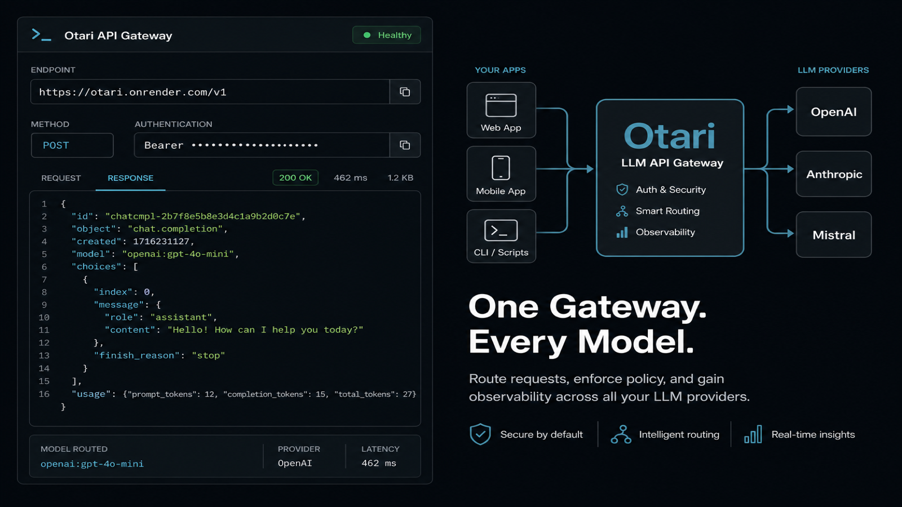
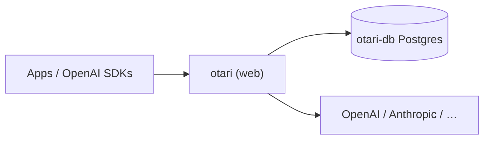

# Otari on Render

> Self-hosted OpenAI-compatible LLM gateway: one endpoint for 40+ providers, with virtual keys, budgets, and usage tracking on managed Postgres.

[](https://render.com/deploy-template/api/github/start?template_repo=<TEMPLATE_REPO_SLUG>)

**Current fork (Blueprint smoke-test):** [ojusave/otari](https://github.com/ojusave/otari) branch [`render-templates`](https://github.com/ojusave/otari/tree/render-templates). Use [Deploy Blueprint](https://render.com/deploy?repo=https://github.com/ojusave/otari&branch=render-templates) until this lands under `render-examples` with `is_template: true`. The one-click gallery button above is the publish-time URL.

Deploy [Otari](https://github.com/mozilla-ai/otari) (Mozilla AI) on Render without building the Python source tree. This template pulls the official `mzdotai/otari` image, wires Render Postgres for durable keys and usage, auto-generates a master key, and bootstraps a first-use API key on startup. Bring at least one provider key and point any OpenAI client at your `*.onrender.com` URL.



---

## Table of contents

- [Why deploy Otari on Render](#why-deploy-otari-on-render)
- [Use cases](#use-cases)
- [What gets deployed](#what-gets-deployed)
- [Quickstart](#quickstart)
- [Configuration](#configuration)
- [Cost breakdown](#cost-breakdown)
- [Customization](#customization)
- [Operations](#operations)
- [Upgrading](#upgrading)
- [Troubleshooting](#troubleshooting)
- [FAQ](#faq)
- [Security](#security)
- [Caveats and limitations](#caveats-and-limitations)
- [Credits and license](#credits-and-license)

---

## Why deploy Otari on Render

- **Managed Postgres wired automatically** — `OTARI_DATABASE_URL` comes from `fromDatabase`; keys, budgets, and usage survive restarts without a compose file.
- **Official image, no monorepo build** — Render pulls `mzdotai/otari:0.2.0` instead of compiling the uv/Python tree on every deploy.
- **Env-only PaaS config** — Otari documents `OTARI_*` scalars and `OTARI_CONFIG_YAML` for platforms where mounting `config.yml` is awkward; this Blueprint uses that path.
- **Private DB network** — Postgres has an empty `ipAllowList`, so only services in your Render workspace reach it over the private network.
- **Ready on first boot** — `auto_migrate` and `bootstrap_api_key` create the schema and mint a first-use `gw-…` key with no extra steps. `OTARI_REQUIRE_PRICING=false` keeps an env-only deploy usable before you configure pricing.

## Use cases

What you can build or run with this template:

- **Team LLM proxy** — one OpenAI-compatible base URL for apps and SDKs, with virtual keys you can revoke per app or teammate.
- **Budget enforcement before spend** — per-user and per-key budgets checked before the provider call, not reconciled after the invoice.
- **Usage and cost visibility** — query `/v1/usage` across models and apps from a single gateway.
- **Multi-provider routing** — route `openai:…`, `anthropic:…`, `mistral:…`, `gemini:…` (and more via [any-llm](https://github.com/mozilla-ai/any-llm)) without changing client code beyond the model string.
- **Hybrid with otari.ai** — set `OTARI_AI_TOKEN` later if you want the hosted platform to own routing and auth while this instance stays the edge proxy.

## What gets deployed



| Resource | Type | Plan | Purpose |
|----------|------|------|---------|
| `otari` | Web service (`runtime: image`) | Starter | Official Otari gateway image; public HTTPS |
| `otari-db` | Render Postgres | Basic-256mb | Keys, users, budgets, usage, pricing rows |

Region: **oregon** (override `region` on both resources in [`render.yaml`](./render.yaml) if you want another).

This Blueprint does **not** deploy optional Docker Compose profiles (code-exec sandbox, SearXNG web search, guardrails). Those need separate private services; see [Customization](#add-optional-tool-backends).

## Quickstart

1. Click **[Deploy to Render](https://render.com/deploy-template/api/github/start?template_repo=<TEMPLATE_REPO_SLUG>)**. Until gallery publish, use [Blueprint deploy of this fork](https://render.com/deploy?repo=https://github.com/ojusave/otari&branch=render-templates) with branch `render-templates` and Blueprint path `render.yaml`.
2. On Apply, set **at least one** provider key. The form prompts for `OPENAI_API_KEY`; leave it blank only if you will add `ANTHROPIC_API_KEY`, `MISTRAL_API_KEY`, or `GEMINI_API_KEY` immediately after deploy.
3. Confirm `otari` (Starter) and `otari-db` (Basic-256mb). Leave generated `OTARI_MASTER_KEY` alone.
4. Wait until both resources are **Live** (~3–6 minutes: image pull + first migrate).
5. Open the `otari` service **Logs**, copy the bootstrap `gw-…` API key printed once on first startup, then open the `*.onrender.com` URL and hit health:

```bash
export OTARI_URL=https://<your-otari-service>.onrender.com

curl "$OTARI_URL/health"
# {"status":"healthy",…}
```

Make a metered chat request (use the provider that matches the key you set):

```bash
curl "$OTARI_URL/v1/chat/completions" \
  -H "Authorization: Bearer gw-..." \
  -H "Content-Type: application/json" \
  -d '{
    "model": "openai:gpt-4o-mini",
    "messages": [{"role": "user", "content": "Say hello in one short sentence."}]
  }'
```

OpenAI SDK:

```python
from openai import OpenAI

client = OpenAI(api_key="gw-...", base_url="https://<your-otari-service>.onrender.com/v1")
print(client.chat.completions.create(
    model="openai:gpt-4o-mini",
    messages=[{"role": "user", "content": "Hello from Otari on Render"}],
).choices[0].message.content)
```

Interactive docs: `$OTARI_URL/docs` (enabled by default in the image).

### Three keys (do not mix them up)

| Key | Env / source | Used for |
|-----|--------------|----------|
| Provider key | `OPENAI_API_KEY` (or Anthropic/Mistral/Gemini) | Real upstream credential; stays inside Otari |
| Master key | `OTARI_MASTER_KEY` (auto-generated) | Management: `/v1/keys`, `/v1/users`, `/v1/budgets`, … |
| API / virtual key | `gw-…` from logs or `POST /v1/keys` | What clients send as `Authorization: Bearer` |

Mint a named key with the master key:

```bash
curl -X POST "$OTARI_URL/v1/keys" \
  -H "Authorization: Bearer $OTARI_MASTER_KEY" \
  -H "Content-Type: application/json" \
  -d '{"key_name": "render-app"}'
```

The full `gw-…` value is shown only once.

## Configuration

### Required secrets

You set these in the Render dashboard during the Apply step. The gateway process can start without a provider key, but chat completions fail until one is present.

| Env var | What it's for | How to get it |
|---------|---------------|---------------|
| `OPENAI_API_KEY` | OpenAI provider credential (prompted at Apply) | [platform.openai.com/api-keys](https://platform.openai.com/api-keys) |

**At least one** of `OPENAI_API_KEY`, `ANTHROPIC_API_KEY`, `MISTRAL_API_KEY`, or `GEMINI_API_KEY` must be set for the gateway to serve traffic. Add non-OpenAI keys on the `otari` service → **Environment** after deploy if you prefer those providers. Provider list: [docs/models.md](./docs/models.md).

`OPENAI_API_KEY` is optional in the Blueprint form as a convenience: you are not limited to OpenAI. The underlying [any-llm](https://github.com/mozilla-ai/any-llm) SDK reads each provider's native env var directly.

### Auto-generated secrets

Render generates these on first deploy and stores them as service env vars. **Do not rotate `OTARI_MASTER_KEY` casually** — rotating invalidates management access until you update every operator script that stored the old value. It does not revoke existing `gw-…` API keys in the database.

| Env var | Purpose |
|---------|---------|
| `OTARI_MASTER_KEY` | Protects management endpoints (`/v1/keys`, `/v1/users`, `/v1/budgets`, `/v1/pricing`, …) |

### Wired automatically from other resources

The Blueprint wires these via `fromDatabase` / `fromService` references. You never type them.

| Env var | Source |
|---------|--------|
| `OTARI_DATABASE_URL` | `otari-db` → `connectionString` (Render internal Postgres URL) |

Otari normalizes `postgresql://` to its async driver automatically, so the Render connection string works without edits.

### Optional tweaks

Common things people change after deploying. All of these are env vars you can add or override in the dashboard or in `render.yaml`.

| Env var | Default | What it does |
|---------|---------|--------------|
| `OTARI_REQUIRE_PRICING` | `false` | Image default is `true` (reject unpriced models). Set `false` so an env-only deploy works before you configure pricing. |
| `OTARI_AUTO_MIGRATE` | `true` | Run Alembic migrations on startup |
| `OTARI_BOOTSTRAP_API_KEY` | `true` | Mint a first-use `gw-…` key when the DB has none |
| `OTARI_DEFAULT_PRICING` | unset (`false`) | Fall back to bundled genai-prices community rates |
| `OTARI_RATE_LIMIT_RPM` | unset | Per-user requests per minute |
| `OTARI_ENABLE_METRICS` | unset (`false`) | Prometheus `/metrics` |
| `OTARI_CONFIG_YAML` | unset | Full YAML config (providers, pricing, CORS, …) as a multiline env value |
| `OTARI_CONFIG_B64` | unset | Same YAML, base64-encoded (safer in some UIs) |
| `OTARI_AI_TOKEN` | unset | Enables **hybrid** mode with [otari.ai](https://otari.ai) |
| `PORT` / `OTARI_PORT` | `8000` | Must stay aligned; Otari does not read Render's `PORT` alone |

To serve priced models with fail-closed billing, set `OTARI_REQUIRE_PRICING=true` and supply `pricing` (or `default_pricing: true`) through `OTARI_CONFIG_YAML` / `OTARI_CONFIG_B64`. See [Full config via environment](./docs/configuration.md#full-config-via-environment).

Full upstream config reference: [Configuration](./docs/configuration.md).

## Cost breakdown

| Resource | Plan | Monthly cost |
|----------|------|--------------|
| `otari` | Starter (512 MB / 0.5 CPU) | $7 |
| `otari-db` | Basic-256mb | $6 |
| **Total** | | **~$13** |

Render's full pricing: [render.com/pricing](https://render.com/pricing). Provider LLM usage is billed by OpenAI/Anthropic/etc., not by Render.

**Cheaper:** Free web + Free Postgres exist, but Free web sleeps after inactivity and Free Postgres expires after 30 days. Not recommended for a gateway other services depend on.

**Scale up:** Move `otari` to **Standard** ($25) if you see OOM or slow concurrent streams; bump Postgres to **Basic-1gb** ($19) when connection or storage pressure shows up in metrics.

## Customization

### Pin the upstream version

This template defaults to `docker.io/mzdotai/otari:0.2.0` (matches upstream release [v0.2.0](https://github.com/mozilla-ai/otari/releases/tag/v0.2.0)). Tags: [mzdotai/otari](https://hub.docker.com/r/mzdotai/otari/tags).

```yaml
# render.yaml — under services → otari → image
image:
  url: docker.io/mzdotai/otari:0.2.0   # or 0.2.1, or @sha256:…
```

After editing, push and **Manual Deploy** (image-backed services do not auto-redeploy when a remote tag moves). Avoid floating `latest` in production.

### Add a custom domain

In the Render dashboard, open the `otari` service → **Settings** → **Custom Domains** → **Add**. Render issues TLS automatically. See [Custom domains](https://render.com/docs/custom-domains) for DNS setup.

### Add pricing (fail-closed billing)

When you are ready to reject unpriced models:

1. Set `OTARI_REQUIRE_PRICING=true` (or remove the override so the image default applies).
2. Supply pricing via `OTARI_CONFIG_YAML`, for example:

```yaml
# value of OTARI_CONFIG_YAML
default_pricing: true
# or explicit:
# pricing:
#   openai:gpt-4o-mini:
#     input_price_per_million: 0.15
#     output_price_per_million: 0.60
```

Or use `POST /v1/pricing` with the master key. Database pricing wins over config.

### Connect hybrid mode (otari.ai)

1. In otari.ai: **Organisation → Gateways** → create a gateway → **Create token** (`gw_…` / platform token).
2. Set `OTARI_AI_TOKEN` on the `otari` service.
3. Redeploy. Local provider env vars are unused in hybrid mode; clients authenticate with otari.ai user tokens.

Details: [Modes](./docs/modes.md), [Deployment](./docs/deployment.md).

### Add optional tool backends

Upstream Compose profiles (`code-exec`, `web-search`, `guardrails`) need extra containers on the private network (`OTARI_SANDBOX_URL`, `OTARI_WEB_SEARCH_URL`, `OTARI_GUARDRAILS_URL`). This Blueprint intentionally omits them so the one-click path stays two resources. To add them, create private services from the published images and point the env vars at private DNS hostnames. See [docker-compose.yml](./docker-compose.yml).

## Operations

### Backups

Render Postgres on paid plans includes logical backups and point-in-time recovery options depending on plan. Use the dashboard **Backups** tab on `otari-db`. Export usage/key data via Otari's management APIs if you need an application-level dump.

### Monitoring

- Health: `GET /health` (liveness) and `GET /health/readiness` (readiness).
- Optional Prometheus: set `OTARI_ENABLE_METRICS=true`, then scrape `/metrics`.
- Render metrics: dashboard → `otari` → **Metrics** (CPU, memory, HTTP).

### Scaling

The gateway is largely stateless; state lives in Postgres. You can raise instance count on `otari` without a disk. Keep DB pool settings in mind if you scale out. Do not attach a disk unless you enable local file storage under `files_local_dir`.

### Logs

In the Render dashboard, open the `otari` service → **Logs**. CLI: `render logs --resources <service-id> --tail`. The bootstrap `gw-…` key appears only on the first empty-DB startup: save it immediately.

## Upgrading

### Pick up upstream releases

1. Check [mozilla-ai/otari releases](https://github.com/mozilla-ai/otari/releases) and [CHANGELOG](./CHANGELOG.md).
2. Confirm the matching tag exists on [Docker Hub](https://hub.docker.com/r/mzdotai/otari/tags).
3. Bump `image.url` in `render.yaml`, push, Manual Deploy.
4. With `OTARI_AUTO_MIGRATE=true`, Alembic runs on startup. For cautious upgrades, take a Postgres backup first.

Image-backed services **do not** redeploy when you push a new digest to the same tag on Docker Hub. Change the tag or trigger a deploy hook / Manual Deploy.

### Breaking-change migrations

Watch the upstream [changelog](./CHANGELOG.md) before upgrading across major versions. Notable migrations to date:

- **v0.2.0** — current pin for this Blueprint; confirm release notes before moving to a later tag.
- **`require_pricing` default `true`** — env-only deploys need `OTARI_REQUIRE_PRICING=false` or explicit pricing (this Blueprint sets `false`).

## Troubleshooting

### Deploy fails during image pull

Confirm `docker.io/mzdotai/otari:0.2.0` still exists on Docker Hub and that Render can reach Docker Hub from your region. If you changed the tag to a private or mistyped reference, fix `image.url` and redeploy. Public images need no `registryCredential`.

### Service starts but health check fails

Otari listens on **`OTARI_PORT` (8000 by default)**, not on Render's injected `PORT` alone. This Blueprint sets `PORT=8000` and `OTARI_PORT=8000` together. If you override one without the other, Render's health check against `/health` will fail with "No open ports detected" or repeated 502s. Check logs for bind address and migration errors.

### Blueprint file not found on main

`render.yaml` lives on the `render-templates` branch of this fork, not on `main`. Set **Branch** to `render-templates` and Blueprint path to `render.yaml` (repo-relative), not a GitHub URL fragment like `otari/tree/render-templates/render.yaml`.

### `No API keys found` / missing bootstrap key

With `OTARI_BOOTSTRAP_API_KEY=true` and an empty keys table, Otari prints a `gw-…` key once. If you missed it, use `OTARI_MASTER_KEY` to `POST /v1/keys`. If the DB already had keys from a previous deploy, bootstrap will not print again.

### Chat returns 402 / pricing errors

Image default is fail-closed pricing. This Blueprint sets `OTARI_REQUIRE_PRICING=false`. If you flipped it to `true` without configuring pricing, either add pricing (`OTARI_CONFIG_YAML` / `/v1/pricing`) or set `OTARI_REQUIRE_PRICING=false` again. Optionally enable `OTARI_DEFAULT_PRICING=true` for community rates.

### Provider auth errors (401/403 from upstream)

The model string must match a provider whose env key is set (`openai:…` needs `OPENAI_API_KEY`, etc.). Check the `otari` Environment tab and the request `model` field.

### Anything else

- Service-level logs: dashboard → **Logs** (or `render logs --resources <id> --tail`)
- Deploy-level logs: dashboard → **Events** → click the failed deploy
- Open an issue on this fork for template packaging bugs
- Open an issue [upstream](https://github.com/mozilla-ai/otari/issues) for application bugs

## FAQ

### Do I need an otari.ai account?

No. Standalone mode (this Blueprint's default) only needs a provider key and the generated master key. Hybrid mode is optional via `OTARI_AI_TOKEN`.

### Why is the Deploy button still `<TEMPLATE_REPO_SLUG>`?

Gallery one-click requires a repo under `render-examples` marked `is_template: true` with `render.yaml` on the default branch. Until then, use the Blueprint link for [ojusave/otari@render-templates](https://render.com/deploy?repo=https://github.com/ojusave/otari&branch=render-templates).

### Where is the UI?

Otari is an API gateway. Use `/docs` (Swagger), the Postman collection in `docs/public/`, or any OpenAI-compatible client. There is no separate admin SPA in this image.

### Can I use Anthropic / Mistral / Gemini instead of OpenAI?

Yes. Add the matching env var on the service and call models like `anthropic:claude-sonnet-4-6`. You can set multiple provider keys at once.

### Does this include code execution, web search, or guardrails?

Not in the default Blueprint. Those are opt-in Compose profiles with extra images. See [Add optional tool backends](#add-optional-tool-backends).

### Can I run this on Render's free plan?

Technically you can change plans in the dashboard, but Free web sleeps after ~15 minutes of idle traffic and Free Postgres expires after 30 days. A shared LLM gateway usually wants always-on Starter + paid Postgres.

### Does this template use a persistent disk?

No. State lives in managed Postgres. Local file uploads under the default `files_local_dir` do not survive deploys unless you add a disk and reconfigure the path. There is nothing to "move off a disk" in the default Blueprint.

### Will my provider keys leave my Render account?

In standalone mode, provider keys stay in your Otari service env and are used only for upstream calls. Usage rows live in your Render Postgres. Hybrid mode sends routing/auth/usage to otari.ai per upstream docs.

## Security

- **Encryption at rest:** Render encrypts managed Postgres at rest; application-level field encryption is not added by this Blueprint.
- **Encryption in transit:** TLS to the `*.onrender.com` hostname and to managed Postgres over the private network.
- **Network exposure:** `otari` is public HTTPS. `otari-db` has `ipAllowList: []` (private only).
- **Secret rotation:** Rotate provider keys in the dashboard and redeploy/restart. Rotating `OTARI_MASTER_KEY` requires updating operator tooling; revoke `gw-…` keys via the management API when a client is compromised.
- **Reporting vulnerabilities:** template packaging → this fork; application issues → [SECURITY.md](./SECURITY.md).

## Caveats and limitations

- **Image pin, not `latest`** — you must bump `image.url` (or Manual Deploy) to pick up upstream releases.
- **No Compose tool profiles** — sandbox, SearXNG, and guardrails are out of scope for the two-resource Blueprint.
- **`OTARI_REQUIRE_PRICING=false`** — convenient for first run; turn pricing on before you rely on budget enforcement for unlisted models.
- **Port coupling** — keep `PORT` and `OTARI_PORT` both at `8000` unless you change both and understand Render's port detection.
- **Ephemeral filesystem** — local file uploads under the default `files_local_dir` do not survive deploys unless you add a disk and reconfigure the path.
- **Starter memory** — adequate for the slim Python gateway; heavy concurrency or large uploads may need Standard.
- **Branch layout (this fork)** — `main` tracks upstream without `render.yaml`; Render packaging lives on `render-templates` until published under `render-examples`.

## Credits and license

- **Upstream:** [mozilla-ai/otari](https://github.com/mozilla-ai/otari) — Apache-2.0 (see [LICENSE](./LICENSE))
- **Image:** [mzdotai/otari](https://hub.docker.com/r/mzdotai/otari) on Docker Hub
- **Render packaging:** [ojusave/otari](https://github.com/ojusave/otari) branch `render-templates`
- **Template maintainer:** [ojusave](https://github.com/ojusave)

If this template helped you, give the upstream repo a star.
